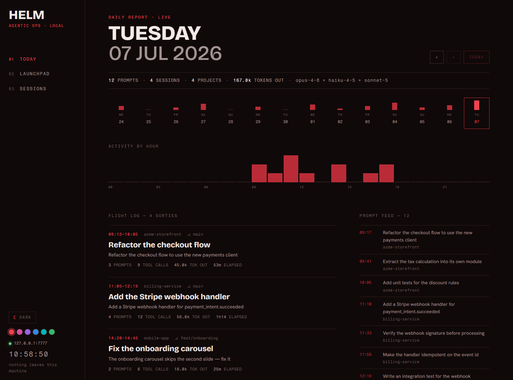

# HELM

> Your agentic operations console. Daily flight logs, one-click skill launches, and every Claude Code session on one local instrument panel — nothing leaves the machine.

HELM sits on top of Claude Code's own data (`~/.claude`) and turns it into an operations room. It runs entirely on your machine, binds to localhost only, and has zero dependencies — just Node and the `claude` CLI you already have.

<picture>
  <source media="(prefers-color-scheme: dark)" srcset="docs/helm-dark.png">
  <source media="(prefers-color-scheme: light)" srcset="docs/helm-light.png">
  
</picture>

<sub>Ships with dark and light themes — the sidebar toggles them, and the shot above follows your GitHub theme.</sub>

## What it is

| View | What it shows |
|------|---------------|
| **Today** | A date-navigable daily report — prompts, sessions, projects, tokens out, activity by hour, a flight log of every sortie, and the raw prompt feed |
| **Launchpad** | Every skill and command you have installed, as one-click buttons. Pick a target project and model, arm YOLO or keep permissions. Click any skill for a detail panel; RUN it headless or open a TERM. Enable/disable skills (moves them off Claude Code's path, reversibly — including bulk toggles), or compose a free-form run |
| **Sessions** | Every transcript across every project — searchable ledger with titles, durations, tool calls, and tokens. Click through to the full conversation timeline |
| **Search** | Full-text search across every transcript — find anything you or Claude ever wrote, with highlighted snippets that jump straight to the session |
| **Usage** | Tokens and estimated spend, all-time — a 30-day output chart plus breakdowns by model and by project |
| **Active** | Running now — the runs HELM launched, plus any session touched in the last 15 minutes across your machine |
| **Console** | Live telemetry for headless runs — tool calls tick in as the agent works, with cost and duration on landing |

**RUN vs TERM.** A headless RUN (`claude -p`) can't answer a skill's questions, so HELM makes it the primary action only for autonomous, one-shot skills (`ship`, `cover`, audits). For interactive skills (`voice`, the `gsd-*` chain) TERM is primary — it opens a real terminal you can drive.

Dark and light themes ship together, plus **six accent colors** (crimson, magenta, violet, cobalt, teal, emerald) — the sidebar toggles the theme and swatches pick the accent. Your choices are remembered, and the theme follows your OS preference on first run.

## Requirements

- **[Node.js](https://nodejs.org) 18+** — no `npm install` needed; HELM has no dependencies.
- **[Claude Code](https://claude.com/claude-code)** on your PATH (the `claude` CLI). HELM reads its `~/.claude` data and spawns runs through it.

Works on **macOS, Linux, and Windows**.

## Install

Clone the repo — there's nothing to build and nothing to `npm install`:

```sh
git clone https://github.com/d7rocket/helm.git
cd helm
```

## Run

**macOS / Linux**

```sh
./helm.sh
```

**Windows** — double-click `helm.cmd`, or:

```
helm.cmd
```

**Any platform** (opens nothing, just serves):

```sh
node server.js
# then open http://127.0.0.1:7777
```

One-liner to clone and launch:

```sh
git clone https://github.com/d7rocket/helm.git && cd helm && node server.js
```

Set `HELM_PORT` to bind a different port (e.g. `HELM_PORT=8080 node server.js`).

## Stack

| Layer | Choice | Why |
|-------|--------|-----|
| Server | Node.js, zero dependencies | Nothing to install, nothing to update, nothing phoning home |
| Data | Reads `~/.claude` transcripts, history, skills — read-only | Claude Code already keeps the records; HELM just instruments them |
| Runs | Spawns `claude -p --output-format stream-json`, streamed over SSE | Real headless agent runs from a button |
| Frontend | Vanilla HTML/CSS/JS, fonts bundled locally | No build step, no CDN, works offline |
| Binding | `127.0.0.1:7777` only | Local-first by construction |

## Layout

```
helm/
├── server.js          HTTP server, API routes, SSE
├── lib/
│   ├── store.js       ~/.claude parsers (sessions, history, skills) + cache
│   └── runner.js      headless claude runs, kill, cross-platform terminal launch
├── public/
│   ├── index.html     shell
│   ├── styles.css     the instrument panel (dark + light themes)
│   ├── theme-init.js  sets the theme before first paint (no flash)
│   ├── app.js         router + views
│   └── fonts/         Bricolage Grotesque · Hanken Grotesk · Fragment Mono
├── data/              helm.config.json (pins, target, yolo) — gitignored
├── helm.cmd           Windows launcher
└── helm.sh            macOS / Linux launcher
```

## Notes

- **YOLO ARMED** runs headless with `--dangerously-skip-permissions`. Flip it off to run permission-gated instead.
- Runs are capped at 3 concurrent; kill any run from the console bar.
- All parsing is cached by file mtime — the first load reads your transcripts, after that it's instant.
- Nothing is written to `~/.claude`. HELM only writes its own `data/helm.config.json`.

## Fonts

Bundled locally under `public/fonts/`, all under the SIL Open Font License:
[Bricolage Grotesque](https://github.com/ateliertriay/bricolage), [Hanken Grotesk](https://github.com/marcologous/Hanken-Grotesk), [Fragment Mono](https://github.com/weiweihuanghuang/fragment-mono).

## License

MIT — see [LICENSE](LICENSE).
